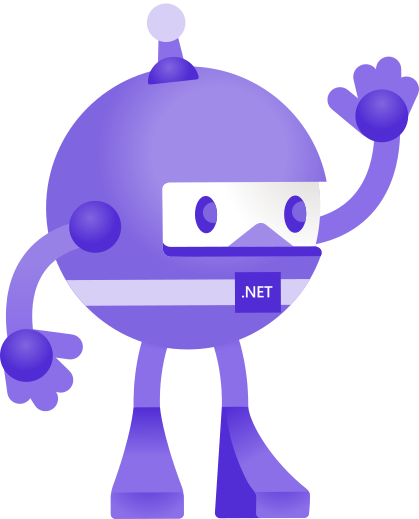
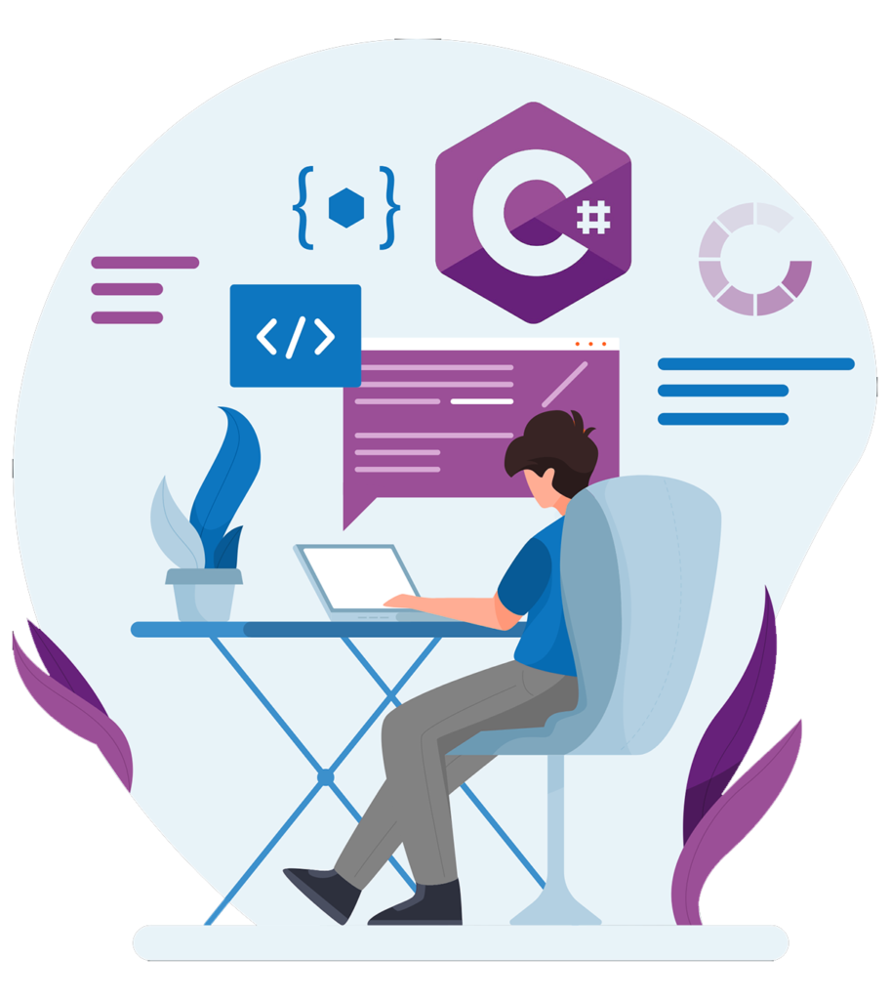
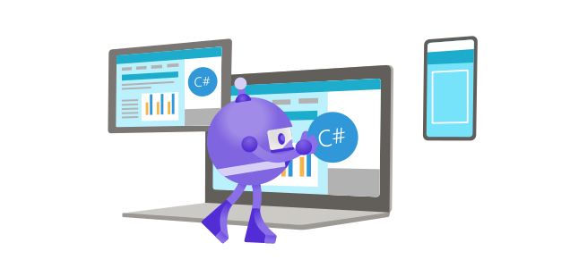

# <h1 style="font-family: 'Tomorrow', sans-serif;height=50px">Hello! I'm Victor Dolsan</h1>
<h2 style="font-size: 20px">My name is Victor Dolsan, I'm a brazilian full stack developer working in Brazil.
I've started my career in IT back in 2011 when I was 19 years old when I was accepted in a University in Rio de Janeiro's countryside. I've studied for 3 years before I move to Auckland-New Zealand where I lived for about 4 years.
In New Zealand I worked in many jobs such as Labour, Waiter, Factory Worker, Cleaner, helping carpenters. My time in New Zealand was the best experience I could ever had; the country is beautiful and well organized. By the time I was there I finished a level 7 IT bachelor graduation.
I returned to Brazil in 2021 when I got a job as a Quality Assurance and right after as a Software Developer.</h2>

## <h1 style="font-family: 'Tomorrow', sans-serif;">Socials:</h1>

## <h1 style="font-family: 'Tomorrow', sans-serif;">Knowledge:</h1> 

[//]: # ()
<!-- -->
<!---->

- ### <b> Back-end: </b>
    - <code></code>

[//]: # (    - <code></code>)

- ### <b> Front-end: </b>
    - <code></code>
    - <code></code>
    - <code></code>
- ### <b> Libraries and Frameworks: </b>    
  - <code></code>
  -   <code></code>
  -   <code></code>
  -   <code></code>
  -   <code></code>
  -   <code></code>
  -   <code></code>
  
- ### <b> Tools: </b>
    - <code></code>
    - <code></code>
    - <code></code>
    - <code></code>
    - <code></code>
    - <code></code>
    - <code></code>
    - <code></code>
    - <code></code>
    - <code></code>
    - <code></code>
    - <code></code>

 - ### <b> Test: </b>
    - <code></code>
    - <code></code>   
    - <code></code>   

## <b>GitHub Stats:</b>

<image width="880em" src="https://github-profile-summary-cards.vercel.app/api/cards/profile-details?username=VictorDolzan&theme=prussian">

<link rel="preconnect" href="https://fonts.googleapis.com">
<link rel="preconnect" href="https://fonts.gstatic.com" crossorigin>
<link href="https://fonts.googleapis.com/css2?family=Tomorrow:ital,wght@0,400;0,500;1,300&display=swap" rel="stylesheet">
